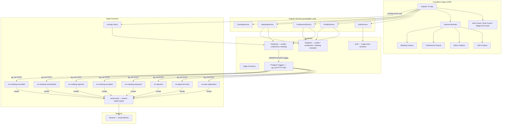
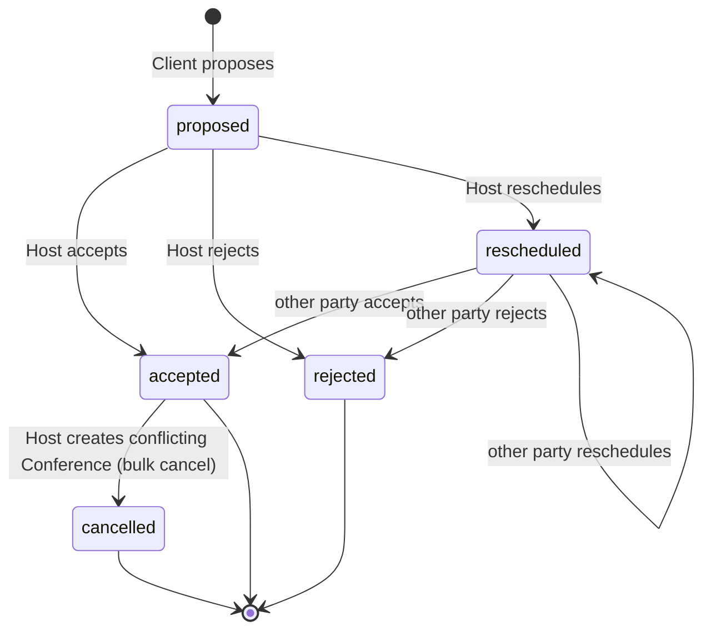

# Design Document — Conference & Meeting Platform (Estafeta)

## Overview

Estafeta is a single-page application (SPA) built with Angular 21, backed by Supabase for
authentication, data storage, and serverless email delivery. The platform serves two core
workflows: open conferences hosted by producers/product providers/service providers, and private
meeting negotiations between clients and host users.

The architecture follows a service-oriented Angular pattern: thin, signal-driven components
delegate all data access to injectable services that wrap the Supabase client. Email
notifications are decoupled from the frontend and executed inside dedicated Supabase Edge
Functions. The application is deployed on Cloudflare Pages as a static SPA.

### Key Design Decisions

- **Signal-first state**: All component and shared state is managed with Angular signals
  (`signal()`, `computed()`, `effect()`). No RxJS `BehaviorSubject` for state.
- **Reactive Forms throughout**: All forms use `FormGroup` / `FormControl` for validation and
  submission.
- **OnPush everywhere**: Every component declares `ChangeDetectionStrategy.OnPush` to keep
  rendering predictable.
- **Lazy-loaded feature routes**: Each domain area (auth, admin, conferences, meetings) is its
  own lazy-loaded route module loaded via `loadComponent` / `loadChildren`.
- **Edge Functions own all notifications**: Every transactional email is triggered entirely
  within the Supabase backend — either by a Postgres database trigger invoking an Edge
  Function via `pg_net`, or by one Edge Function calling a shared `send-email` helper Edge
  Function. The Angular frontend never calls a notification Edge Function directly and has no
  `NotificationService`. This removes secret-key exposure risk and keeps notification logic
  fully server-side.
- **Magic-link-only set-password route**: The `/auth/set-password` route is protected by a
  `magicLinkGuard` that verifies the presence of a valid Supabase `access_token` in the URL
  hash before rendering the component. Direct navigation without a token redirects to
  `/auth/login`. This prevents the password-setup form from being accessible without a
  legitimate invite link.
- **Role-adaptive views**: Conferences and meetings are served through shared components
  (`ConferenceListComponent`, `MeetingListComponent`, `MeetingDetailComponent`,
  `ConferenceFormComponent`, `MeetingFormComponent`). Each component reads the authenticated
  user's `categoria` from `AuthService.profile` and adapts its rendered content, available
  actions, and data filters accordingly. There are no separate role-namespaced route subtrees
  (`/app/host/`, `/app/client/`).
- **CalendarComponent as home view**: Authenticated non-admin users land on a
  `CalendarComponent` (PrimeNG `p-fullCalendar`) that shows all upcoming conferences and
  the user's own meetings colour-coded by status: green for `accepted`, blue for `proposed`
  or `rescheduled`, red for `rejected` or `cancelled`.
- **Fused admin user list**: A single `AdminUserListComponent` handles both pending
  registrations and all-user management. A filter bar (default: `estado = pending`) lets
  the admin switch between views without navigating to a separate route.
- **Full Spanish UI**: The entire user-facing interface is rendered in Spanish. All labels,
  button text, error messages, validation messages, toast notifications, column headers, and
  placeholder text are written in Spanish. No i18n library is required — strings are defined
  as constants in a shared `src/app/shared/i18n/es.ts` file and imported by components. Date
  and time values are formatted using `date-fns` with the `es` locale.
- **Supabase Realtime for live data**: All data-bearing services (`ProfileService`,
  `ConferenceService`, `MeetingService`) subscribe to Supabase Realtime channels on
  initialisation. Each service maintains a `RealtimeChannel` that listens for `INSERT`,
  `UPDATE`, and `DELETE` events on its corresponding table and patches the in-memory signal
  accordingly, so every view refreshes automatically without manual polling or page reloads.

---

## Architecture

### High-Level Diagram



### Route Architecture

```
/                          → redirect → /calendar (authenticated) or /conferences (public)
/auth/login                → LoginComponent (publicOnlyGuard)
/auth/register             → RegisterComponent (publicOnlyGuard)
/auth/set-password         → SetPasswordComponent (magicLinkGuard — token must be in URL hash)

/conferences               → ConferenceListComponent (public)
/conferences/new           → ConferenceFormComponent (authGuard + roleGuard: host | admin)
/conferences/:id           → ConferenceDetailComponent (public)
/conferences/:id/edit      → ConferenceFormComponent (authGuard + roleGuard: host | admin)

/meetings                  → MeetingListComponent (authGuard + roleGuard: host | client | admin)
/meetings/new              → MeetingFormComponent (authGuard + roleGuard: client)
/meetings/:id              → MeetingDetailComponent (authGuard + roleGuard: host | client | admin)

/calendar                  → CalendarComponent (authGuard + roleGuard: host | client)

/admin                     → AdminShellComponent (authGuard + roleGuard: admin)
  /users                   → AdminUserListComponent (fused pending + all users, filter by estado)
  /users/:id               → AdminUserDetailComponent
```

The `/app/host/`, `/app/client/` subtrees are removed. All shared routes adapt their
rendered content and available actions based on `AuthService.profile().categoria`.

---

## Components and Interfaces

### Angular Services

#### `AuthService` (`src/app/core/auth/auth.service.ts`)

Wraps Supabase Auth. Exposes signals for the current session and user profile.

```typescript
interface AuthService {
  session: Signal<Session | null>;
  profile: Signal<Profile | null>;
  isLoading: Signal<boolean>;

  // Two-step login: first validate email, then password
  checkEmail(email: string): Promise<{ exists: boolean; estado: ProfileEstado | null }>;
  signIn(email: string, password: string): Promise<{ error: AuthError | null }>;
  signOut(): Promise<void>;
  setPassword(password: string): Promise<{ error: AuthError | null }>;
  refreshSession(): Promise<void>;
}
```

#### `ProfileService` (`src/app/core/profile/profile.service.ts`)

Reads and writes the `profile` table. Subscribes to the `profiles` Realtime channel on
construction; the `pendingProfiles` and `allProfiles` signals update automatically when rows
are inserted, updated, or deleted.

```typescript
interface ProfileService {
  // Live signals — updated by Realtime
  pendingProfiles: Signal<Profile[]>; // estado = 'pending', ordered by created_at desc
  allProfiles: Signal<Profile[]>; // all rows, ordered by created_at desc

  createProfile(data: CreateProfileDto): Promise<{ data: Profile | null; error: unknown }>;
  getProfile(userId: string): Promise<Profile | null>;
  getPendingProfiles(page: number): Promise<PaginatedResult<Profile>>;
  getAllProfiles(page: number, filters: ProfileFilters): Promise<PaginatedResult<Profile>>;
  approveProfile(profileId: string): Promise<{ error: unknown }>;
  rejectAndDeleteProfile(profileId: string): Promise<{ error: unknown }>;
  updateEstado(profileId: string, estado: ProfileEstado): Promise<{ error: unknown }>;

  // Realtime lifecycle (called by the service constructor / DestroyRef)
  subscribeRealtime(): void;
  unsubscribeRealtime(): void;
}
```

#### `ConferenceService` (`src/app/core/conference/conference.service.ts`)

Subscribes to the `conferences` Realtime channel on construction. The `conferences` signal
is patched in-place on every `INSERT`, `UPDATE`, and `DELETE` event so all views stay live
without manual refreshes.

```typescript
interface ConferenceService {
  // Live signal — updated by Realtime
  conferences: Signal<ConferenceWithSpeaker[]>;
  upcomingConferences: Signal<ConferenceWithSpeaker[]>; // computed: starting >= now, asc

  getConferenceById(id: string): Promise<ConferenceWithSpeaker | null>;
  getMyConferences(speakerId: string): Signal<Conference[]>; // filtered computed from conferences
  getAllConferences(page: number): Promise<PaginatedResult<Conference>>;
  createConference(data: CreateConferenceDto): Promise<{ data: Conference | null; error: unknown }>;
  updateConference(id: string, data: UpdateConferenceDto): Promise<{ error: unknown }>;
  deleteConference(id: string): Promise<{ error: unknown }>;

  // Realtime lifecycle
  subscribeRealtime(): void;
  unsubscribeRealtime(): void;
}
```

#### `MeetingService` (`src/app/core/meeting/meeting.service.ts`)

Subscribes to the `meetings` Realtime channel on construction, filtered to rows where
`speaker_id = auth.uid()` OR `participant_id = auth.uid()` (or all rows for admin). The
`meetings` signal is patched on every event so lists and detail views update without reload.

```typescript
interface MeetingService {
  // Live signals — updated by Realtime
  meetings: Signal<MeetingWithParties[]>;
  meetingsAsClient: Signal<MeetingWithParties[]>; // computed: participant_id = currentUserId
  meetingsAsHost: Signal<MeetingWithParties[]>; // computed: speaker_id = currentUserId
  actionRequiredCount: Signal<number>; // computed: pending action for current user

  getMeetingById(id: string): Promise<MeetingWithParties | null>;
  getAllMeetings(page: number): Promise<PaginatedResult<MeetingWithParties>>;
  proposeMeeting(data: ProposeMeetingDto): Promise<{ data: Meeting | null; error: unknown }>;
  acceptMeeting(id: string, responderId: string, note?: string): Promise<{ error: unknown }>;
  rejectMeeting(id: string, responderId: string, note?: string): Promise<{ error: unknown }>;
  rescheduleMeeting(id: string, data: RescheduleMeetingDto): Promise<{ error: unknown }>;
  cancelMeetings(ids: string[], reason: string): Promise<{ error: unknown }>;

  // Realtime lifecycle
  subscribeRealtime(): void;
  unsubscribeRealtime(): void;
}
```

#### Notification Architecture — Server-Side Only

All transactional emails are triggered exclusively by the Supabase backend. The Angular
frontend has no `NotificationService` and makes no notification-related HTTP calls.

**Trigger chain:**

```
Database event (INSERT / UPDATE on profile or meeting)
  → Postgres trigger function (using pg_net extension)
    → HTTP POST to Supabase Edge Function (e.g. on-meeting-proposed)
      → Edge Function invokes shared send-email Edge Function
        → send-email calls Resend API with service-role key
```

**Postgres trigger → Edge Function mapping:**

| Table     | Event                    | Condition                                  | Edge Function            |
| --------- | ------------------------ | ------------------------------------------ | ------------------------ |
| `profile` | `AFTER INSERT`           | always                                     | `on-new-registration`    |
| `profile` | `AFTER UPDATE OF estado` | `NEW.estado = 'approved'`                  | `on-approval-invite`     |
| `profile` | `AFTER UPDATE OF estado` | `NEW.estado = 'rejected'` (or row deleted) | `on-rejection`           |
| `meeting` | `AFTER INSERT`           | `NEW.status = 'proposed'`                  | `on-meeting-proposed`    |
| `meeting` | `AFTER UPDATE OF status` | `NEW.status = 'accepted'`                  | `on-meeting-accepted`    |
| `meeting` | `AFTER UPDATE OF status` | `NEW.status = 'rejected'`                  | `on-meeting-rejected`    |
| `meeting` | `AFTER UPDATE OF status` | `NEW.status = 'rescheduled'`               | `on-meeting-rescheduled` |
| `meeting` | `AFTER UPDATE OF status` | `NEW.status = 'cancelled'`                 | `on-meeting-cancelled`   |

**Shared `send-email` Edge Function** accepts a unified payload:

```typescript
interface SendEmailPayload {
  to: string;
  templateId: string; // maps to a Resend template
  variables: Record<string, string>;
}
```

All notification-specific Edge Functions resolve recipient emails and template variables
from the database row data (using the service-role key) and then call `send-email`. Retry
logic (up to 3 attempts, 15-second intervals) lives inside `send-email`. Failures are logged
to a `notification_log` table — no frontend involvement.

#### `OverlapService` (`src/app/core/overlap/overlap.service.ts`)

Provides pure time-interval overlap detection used both in the frontend validators and called
server-side from the Edge Function.

```typescript
interface OverlapService {
  // Pure function: do two half-open intervals [a.start, a.end) and [b.start, b.end) overlap?
  intervalsOverlap(a: TimeInterval, b: TimeInterval): boolean;
  // Check a proposed interval against a list of existing intervals
  findOverlaps(proposed: TimeInterval, existing: TimeInterval[]): TimeInterval[];
}
```

### Realtime Subscription Pattern

Each data-bearing service follows this pattern using `supabase.channel()`. The subscription
is established in the service constructor and torn down via Angular's `DestroyRef`.

```typescript
// Example: ConferenceService realtime subscription
subscribeRealtime(): void {
  this.channel = this.supabase
    .channel('conferences')
    .on(
      'postgres_changes',
      { event: '*', schema: 'public', table: 'conference' },
      (payload) => {
        if (payload.eventType === 'INSERT') {
          this.conferences.update((list) => [...list, payload.new as ConferenceWithSpeaker]);
        } else if (payload.eventType === 'UPDATE') {
          this.conferences.update((list) =>
            list.map((c) => (c.id === payload.new.id ? (payload.new as ConferenceWithSpeaker) : c)),
          );
        } else if (payload.eventType === 'DELETE') {
          this.conferences.update((list) => list.filter((c) => c.id !== payload.old.id));
        }
      },
    )
    .subscribe();
}

unsubscribeRealtime(): void {
  if (this.channel) {
    this.supabase.removeChannel(this.channel);
  }
}
```

`MeetingService` uses a filtered channel (Supabase Realtime row-level filters) to ensure
each authenticated user only receives events for rows they are party to:

```typescript
// MeetingService filtered channel (host side)
this.supabase
  .channel('meetings-host')
  .on(
    'postgres_changes',
    {
      event: '*',
      schema: 'public',
      table: 'meeting',
      filter: `speaker_id=eq.${currentUserId}`,
    },
    handler,
  )
  .subscribe();

// MeetingService filtered channel (client side)
this.supabase
  .channel('meetings-client')
  .on(
    'postgres_changes',
    {
      event: '*',
      schema: 'public',
      table: 'meeting',
      filter: `participant_id=eq.${currentUserId}`,
    },
    handler,
  )
  .subscribe();
```

`AdminMeetingService` (or the admin context of `MeetingService`) subscribes to an unfiltered
`meeting` channel since admins have RLS SELECT on all rows.

### Spanish UI — String Constants

All user-visible text is written in Spanish. Strings are centralised in
`src/app/shared/i18n/es.ts` and imported by components — no Angular i18n or `@ngx-translate`
library is needed.

```typescript
// src/app/shared/i18n/es.ts  (partial example)
export const ES = {
  auth: {
    loginTitle: 'Iniciar sesión',
    emailLabel: 'Correo electrónico',
    passwordLabel: 'Contraseña',
    loginButton: 'Entrar',
    logoutButton: 'Cerrar sesión',
    registerLink: 'Crear cuenta',
    pendingMessage: 'Tu registro está pendiente de aprobación por un administrador.',
    notRegisteredError: 'El correo electrónico no está registrado.',
    invalidCredentials: 'Credenciales incorrectas.',
    accountLocked: 'Cuenta bloqueada temporalmente. Inténtalo de nuevo en 15 minutos.',
    sessionExpired: 'Tu sesión ha expirado. Por favor, inicia sesión de nuevo.',
  },
  register: {
    title: 'Solicitar acceso',
    submitButton: 'Enviar solicitud',
    successMessage: 'Solicitud enviada. Recibirás un correo cuando sea revisada.',
    emailExists: 'Ya existe una cuenta con este correo electrónico.',
    fields: {
      email: 'Correo electrónico',
      categoria: 'Categoría',
      nombreEmpresa: 'Nombre de la empresa',
      direccionLegal: 'Dirección legal',
      contacto: 'Persona de contacto',
      numFijo: 'Teléfono fijo',
      numMovil: 'Teléfono móvil',
      actividad: 'Actividad',
      ofertaBusqueda: 'Oferta / búsqueda',
    },
    categorias: {
      producer: 'Productor',
      provider: 'Proveedor',
      services: 'Servicios',
      client: 'Cliente',
    },
  },
  conferences: {
    listTitle: 'Próximas conferencias',
    detailTitle: 'Detalle de conferencia',
    newButton: 'Nueva conferencia',
    editButton: 'Editar',
    deleteButton: 'Eliminar',
    noResults: 'No hay conferencias próximas.',
    fields: {
      subject: 'Tema',
      starting: 'Inicio',
      ending: 'Fin',
      location: 'Lugar',
      speaker: 'Ponente',
    },
    errors: {
      endBeforeStart: 'La fecha de fin debe ser posterior a la de inicio.',
      overlap: 'La conferencia se solapa con otra existente. Elige otro horario.',
      loadError: 'No se pudo cargar la lista de conferencias.',
    },
  },
  meetings: {
    listTitle: 'Mis reuniones',
    proposeButton: 'Proponer reunión',
    actionRequired: 'Requiere acción',
    noResults: 'No tienes reuniones registradas.',
    fields: {
      start: 'Inicio',
      ending: 'Fin',
      status: 'Estado',
      responseNote: 'Nota de respuesta',
    },
    statuses: {
      proposed: 'Propuesta',
      accepted: 'Aceptada',
      rejected: 'Rechazada',
      rescheduled: 'Reagendada',
      cancelled: 'Cancelada',
    },
    actions: {
      accept: 'Aceptar',
      reject: 'Rechazar',
      reschedule: 'Reagendar',
    },
    errors: {
      notYourTurn: 'Espera a que la otra parte responda.',
      closed: 'Esta reunión ya no está abierta a negociación.',
      notificationFailed: 'La notificación no pudo enviarse, pero la reunión fue guardada.',
      loadError: 'No se pudo cargar la lista de reuniones.',
    },
  },
  admin: {
    pendingTitle: 'Registros pendientes',
    usersTitle: 'Gestión de usuarios',
    approveButton: 'Aprobar',
    rejectButton: 'Rechazar',
    rejectNoteLabel: 'Nota de rechazo (opcional)',
    alreadyProcessed: 'Este registro ya fue procesado.',
    noResults: 'No hay resultados.',
    filters: {
      categoria: 'Categoría',
      estado: 'Estado',
      all: 'Todos',
    },
  },
  common: {
    save: 'Guardar',
    cancel: 'Cancelar',
    confirm: 'Confirmar',
    delete: 'Eliminar',
    edit: 'Editar',
    back: 'Volver',
    loading: 'Cargando…',
    error: 'Ha ocurrido un error. Por favor, inténtalo de nuevo.',
    required: 'Este campo es obligatorio.',
    maxLength: (max: number) => `Máximo ${max} caracteres.`,
  },
} as const;
```

Date values are formatted using `date-fns` with the `es` locale:

```typescript
import { format } from 'date-fns';
import { es } from 'date-fns/locale';

// Example usage in a component or pipe
format(new Date(conference.starting), "d 'de' MMMM yyyy, HH:mm", { locale: es });
// → "12 de junio 2026, 10:30"
```

A shared `DateFormatPipe` wraps this call for use directly in templates.

### Route Guards

```typescript
// src/app/core/guards/auth.guard.ts
// canActivate: stores URL, redirects to /auth/login if no session
const authGuard: CanActivateFn = ...

// src/app/core/guards/role.guard.ts
// canActivate: redirects to role-appropriate home if categoria mismatch
const roleGuard = (allowedRoles: UserCategoria[]): CanActivateFn => ...

// src/app/core/guards/public-only.guard.ts
// canActivate: redirects authenticated users away from /auth/login, /auth/register
const publicOnlyGuard: CanActivateFn = ...

// src/app/core/guards/magic-link.guard.ts
// canActivate: checks for access_token in URL hash (Supabase invite fragment);
// redirects to /auth/login if token is absent or already consumed
const magicLinkGuard: CanActivateFn = ...
```

### Angular Validators

```typescript
// src/app/shared/validators/date-range.validator.ts
// Cross-field validator: ending must be after start
export function endingAfterStartValidator(): ValidatorFn;

// src/app/shared/validators/future-date.validator.ts
// Validates that a date is in the future
export function futureDateValidator(): ValidatorFn;

// src/app/shared/validators/password-match.validator.ts
// Cross-field validator: password === passwordConfirmation
export function passwordMatchValidator(): ValidatorFn;

// src/app/shared/validators/email-format.validator.ts
// RFC 5322 email format validation
export function emailFormatValidator(): ValidatorFn;
```

### Key Components

| Component                   | Path                          | Guard(s)                                     | Purpose                                                                                                                                                 |
| --------------------------- | ----------------------------- | -------------------------------------------- | ------------------------------------------------------------------------------------------------------------------------------------------------------- |
| `RegisterComponent`         | `auth/register/`              | `publicOnlyGuard`                            | Registration form; creates pending profile                                                                                                              |
| `LoginComponent`            | `auth/login/`                 | `publicOnlyGuard`                            | Two-step login (email check → password)                                                                                                                 |
| `SetPasswordComponent`      | `auth/set-password/`          | `magicLinkGuard`                             | Invite-link password setup; token must be present in URL hash                                                                                           |
| `ConferenceListComponent`   | `conferences/`                | public (anon OK)                             | Upcoming conference list; adapts to show edit/delete actions for host owners and admins                                                                 |
| `ConferenceDetailComponent` | `conferences/:id`             | public (anon OK)                             | Conference detail; shows "Proponer reunión" CTA only to authenticated clients                                                                           |
| `ConferenceFormComponent`   | `conferences/new`, `.../edit` | `authGuard + roleGuard(host\|admin)`         | Create / edit conference; `speaker_id` set automatically from session                                                                                   |
| `MeetingListComponent`      | `meetings/`                   | `authGuard + roleGuard(host\|client\|admin)` | Meeting list; data filtered by role — host sees `speaker_id` rows, client sees `participant_id` rows, admin sees all; action-required indicator per row |
| `MeetingDetailComponent`    | `meetings/:id`                | `authGuard + roleGuard(host\|client\|admin)` | Meeting detail and action panel (accept/reject/reschedule); available actions computed from turn logic                                                  |
| `MeetingFormComponent`      | `meetings/new`                | `authGuard + roleGuard(client)`              | New meeting proposal form (client only)                                                                                                                 |
| `CalendarComponent`         | `calendar/`                   | `authGuard + roleGuard(host\|client)`        | PrimeNG full calendar showing all conferences + user's own meetings; green = accepted, blue = proposed/rescheduled, red = rejected/cancelled            |
| `AdminShellComponent`       | `admin/`                      | `authGuard + roleGuard(admin)`               | Admin layout wrapper                                                                                                                                    |
| `AdminUserListComponent`    | `admin/users`                 | `authGuard + roleGuard(admin)`               | Fused pending + all-users list; default filter `estado = pending`; toggle to show all profiles                                                          |
| `AdminUserDetailComponent`  | `admin/users/:id`             | `authGuard + roleGuard(admin)`               | Full profile detail for admin inspection                                                                                                                |

---

## Data Models

### TypeScript Interfaces

```typescript
// src/app/core/models/profile.model.ts

export type ProfileEstado = 'pending' | 'approved' | 'registered' | 'rejected';
export type UserCategoria = 'admin' | 'producer' | 'provider' | 'services' | 'client';

export interface Profile {
  id: string;
  created_at: string;
  user_id: string;
  categoria: UserCategoria;
  nombre_empresa: string;
  direccion_legal: string;
  contacto: string;
  num_fijo: string | null;
  num_movil: string | null;
  email: string;
  actividad: string;
  oferta_busqueda: string | null;
  estado: ProfileEstado;
}

export interface CreateProfileDto {
  email: string;
  categoria: UserCategoria;
  nombre_empresa: string;
  direccion_legal: string;
  contacto: string;
  num_fijo?: string;
  num_movil?: string;
  actividad: string;
  oferta_busqueda?: string;
}

export interface ProfileFilters {
  categoria?: UserCategoria;
  estado?: ProfileEstado;
}
```

```typescript
// src/app/core/models/conference.model.ts

export interface Conference {
  id: string;
  created_at: string;
  starting: string; // ISO 8601 timestamptz
  ending: string; // ISO 8601 timestamptz
  location: string;
  subject: string;
  speaker_id: string;
}

export interface ConferenceWithSpeaker extends Conference {
  speaker: Pick<Profile, 'nombre_empresa' | 'categoria' | 'contacto' | 'actividad' | 'email'>;
}

export interface CreateConferenceDto {
  starting: string;
  ending: string;
  location: string;
  subject: string;
}

export type UpdateConferenceDto = Partial<CreateConferenceDto>;
```

```typescript
// src/app/core/models/meeting.model.ts

export type MeetingStatus = 'proposed' | 'accepted' | 'rejected' | 'rescheduled' | 'cancelled';

export interface Meeting {
  id: string;
  created_at: string;
  updated_at: string;
  speaker_id: string;
  participant_id: string;
  start: string; // ISO 8601 timestamptz
  ending: string; // ISO 8601 timestamptz
  status: MeetingStatus;
  last_updated_by: string;
  response_note: string | null;
}

export interface MeetingWithParties extends Meeting {
  speaker: Pick<Profile, 'nombre_empresa' | 'contacto'>;
  participant: Pick<Profile, 'nombre_empresa' | 'contacto'>;
}

export interface ProposeMeetingDto {
  speaker_id: string;
  participant_id: string;
  start: string;
  ending: string;
  location: string;
  response_note?: string;
}

export interface RescheduleMeetingDto {
  start: string;
  ending: string;
  response_note?: string;
  rescheduler_id: string;
}
```

```typescript
// src/app/core/models/interval.model.ts

export interface TimeInterval {
  start: Date;
  end: Date;
}
```

```typescript
// src/app/core/models/notification.model.ts — REMOVED
// All notification payloads are constructed server-side inside Edge Functions.
// The frontend has no notification types or service.
```

```typescript
// src/app/core/models/calendar-event.model.ts

export type CalendarEventColor = 'green' | 'blue' | 'red';

export interface CalendarEvent {
  id: string;
  title: string; // subject (conference) or other party's nombre_empresa (meeting)
  start: string; // ISO 8601
  end: string; // ISO 8601
  color: CalendarEventColor;
  type: 'conference' | 'meeting';
  sourceId: string; // original conference.id or meeting.id for navigation
}

// Color mapping:
// conference → blue (informational, not negotiable)
// meeting status 'accepted' → green
// meeting status 'proposed' | 'rescheduled' → blue
// meeting status 'rejected' | 'cancelled' → red
```

```typescript
// src/app/core/models/pagination.model.ts

export interface PaginatedResult<T> {
  data: T[];
  total: number;
  page: number;
  pageSize: number;
}
```

### Meeting State Machine

The `meeting.status` field follows this state machine:



The turn-based constraint: a party cannot accept or reject their own proposal. The
`last_updated_by` field tracks whose action created the current state. If
`last_updated_by === current_user_id` and `status` is `proposed` or `rescheduled`, only
reschedule is permitted.

### Supabase RLS Policy Summary

| Table        | Operation | Allowed when                                                                                     |
| ------------ | --------- | ------------------------------------------------------------------------------------------------ |
| `profile`    | SELECT    | `user_id = auth.uid()` OR `auth.jwt() → categoria = 'admin'`                                     |
| `profile`    | INSERT    | `true` (unauthenticated registration)                                                            |
| `profile`    | UPDATE    | `user_id = auth.uid()` OR `auth.jwt() → categoria = 'admin'`                                     |
| `profile`    | DELETE    | `auth.jwt() → categoria = 'admin'`                                                               |
| `conference` | SELECT    | `true` (public)                                                                                  |
| `conference` | INSERT    | `speaker_id = auth.uid()`                                                                        |
| `conference` | UPDATE    | `speaker_id = auth.uid()`                                                                        |
| `conference` | DELETE    | `speaker_id = auth.uid()` OR `auth.jwt() → categoria = 'admin'`                                  |
| `meeting`    | SELECT    | `speaker_id = auth.uid()` OR `participant_id = auth.uid()` OR `auth.jwt() → categoria = 'admin'` |
| `meeting`    | INSERT    | `participant_id = auth.uid()`                                                                    |
| `meeting`    | UPDATE    | `speaker_id = auth.uid()` OR `participant_id = auth.uid()`                                       |

### Edge Function Schemas

**`send-email` (shared helper)** — invoked by all notification Edge Functions:

```typescript
interface SendEmailPayload {
  to: string;
  templateId: string;
  variables: Record<string, string>;
}
```

**Notification Edge Functions** — triggered by Postgres `pg_net` calls from database triggers; each resolves its own payload from the database before calling `send-email`:

| Function name            | Triggered by                                         | Resolves from DB                                      |
| ------------------------ | ---------------------------------------------------- | ----------------------------------------------------- |
| `on-new-registration`    | `AFTER INSERT ON profile`                            | registrant email, categoria, nombre_empresa           |
| `on-approval-invite`     | `AFTER UPDATE ON profile WHERE estado='approved'`    | recipient email, generated invite link                |
| `on-rejection`           | `AFTER UPDATE ON profile WHERE estado='rejected'`    | recipient email, optional rejection note              |
| `on-meeting-proposed`    | `AFTER INSERT ON meeting WHERE status='proposed'`    | host email, start, ending, client empresa             |
| `on-meeting-accepted`    | `AFTER UPDATE ON meeting WHERE status='accepted'`    | other party's email, start, ending, response_note     |
| `on-meeting-rejected`    | `AFTER UPDATE ON meeting WHERE status='rejected'`    | other party's email, response_note                    |
| `on-meeting-rescheduled` | `AFTER UPDATE ON meeting WHERE status='rescheduled'` | other party's email, new start, ending, response_note |
| `on-meeting-cancelled`   | `AFTER UPDATE ON meeting WHERE status='cancelled'`   | both parties' emails, start, ending                   |

**`overlap-check`** — called directly by the Angular `OverlapService` (the only Edge Function the frontend invokes):

```typescript
interface OverlapCheckRequest {
  start: string; // ISO 8601
  ending: string; // ISO 8601
  type: 'conference' | 'meeting';
  excludeId?: string; // id to skip (for edits)
  userId: string; // scopes the check to the user's own events
}

interface OverlapCheckResponse {
  hasOverlap: boolean;
  conflicts: Array<{ id: string; type: 'conference' | 'meeting'; start: string; ending: string }>;
}
```

---

## Correctness Properties

_A property is a characteristic or behavior that should hold true across all valid executions
of a system — essentially, a formal statement about what the system should do. Properties
serve as the bridge between human-readable specifications and machine-verifiable correctness
guarantees._

### Property 1: Pending Profile on Registration

_For any_ valid set of required registration fields (email, categoria, nombre_empresa,
direccion_legal, contacto, actividad), the `Profile` object constructed before insertion must
always have `estado` equal to `'pending'`, regardless of the other field values.

**Validates: Requirements 1.2**

---

### Property 2: Registration Validation Rejects Missing Required Fields

_For any_ non-empty subset of required registration fields that are absent, the registration
`FormGroup` must be invalid and each absent field control must have a `required` validation
error, leaving the form unsubmittable.

**Validates: Requirements 1.4, 7.4, 9.7**

---

### Property 3: Email Format Validator Correctness

_For any_ string that is not a syntactically valid RFC 5322 email address, the
`emailFormatValidator` must return a non-null error object. _For any_ syntactically valid
email string, the validator must return `null`.

**Validates: Requirements 1.5**

---

### Property 4: Profile Creation Failure Does Not Trigger Notification

_For any_ backend error response from `ProfileService.createProfile()`, no Postgres trigger
fires (because no row is inserted), so no notification Edge Function is invoked. The
frontend must display an error message and perform no further action.

**Validates: Requirements 1.7**

---

### Property 5: Pending Users Never Receive a Session

_For any_ user whose profile `estado` is `'pending'`, the `AuthService.signIn()` flow must
not result in a non-null session being stored in the auth state signal.

**Validates: Requirements 2.2**

---

### Property 6: Approval Trigger Fires Exactly Once

_For any_ `profile` row whose `estado` is updated to `'approved'`, the Postgres
`AFTER UPDATE` trigger must fire the `on-approval-invite` Edge Function exactly once. The
`estado` value must remain `'approved'` regardless of whether the Edge Function call succeeds.

**Validates: Requirements 3.2, 3.5**

---

### Property 7: Approval Email Failure Does Not Revert Estado

_For any_ profile that has been approved (`estado = 'approved'`), if the
`on-approval-invite` Edge Function fails, the profile's `estado` must remain `'approved'` —
no rollback occurs in the trigger function. The failure is logged to `notification_log`.

**Validates: Requirements 3.5**

---

### Property 8: Rejection Trigger Fires Before Row Deletion

_For any_ pending profile being rejected, the `on-rejection` Edge Function must be triggered
(via the `estado = 'rejected'` update path or a `BEFORE DELETE` trigger) and the
notification must be dispatched before the row is deleted, so the recipient email is still
resolvable from the row data.

**Validates: Requirements 3.6**

---

### Property 9: Password Validator Enforces Minimum Length

_For any_ string with `length < 8`, the password `FormControl` validator must return a
non-null error object. _For any_ string with `length >= 8`, it must return `null` (from the
length check alone).

**Validates: Requirements 4.3**

---

### Property 10: Password Match Validator

_For any_ two strings `password` and `confirmation` that are not strictly equal, the
`passwordMatchValidator()` cross-field validator must return a non-null error. _For any_ two
strings that are strictly equal, the validator must return `null`.

**Validates: Requirements 4.4**

---

### Property 11: Role-to-Route Mapping is Complete and Correct

_For any_ `UserCategoria` value, the role guard must allow access according to the following
rules — and must deny access for all other categories:

- Conference management routes: allow `producer | provider | services | admin`
- Meeting proposal routes: allow `client` only
- Admin routes: allow `admin` only

_For any_ category value not in the allowed set, the guard must return `false`.

**Validates: Requirements 6.1, 6.2, 6.3**

---

### Property 12: Post-Login Redirect to Calendar

_For any_ authenticated `UserCategoria` in `{producer, provider, services, client}`, after
a successful login the router must navigate to `/calendar`. For `admin`, the router must
navigate to `/admin/users`. The mapping must be total (every valid categoria maps to a route)
and deterministic.

**Validates: Requirements 5.2**

---

### Property 13: Date-Range Validator — Ending Must Be After Start

_For any_ pair of datetimes `(start, ending)` where `ending <= start`, the
`endingAfterStartValidator()` cross-field validator must return a non-null error. _For any_
pair where `ending > start`, it must return `null`.

**Validates: Requirements 7.3, 9.6, 10.9**

---

### Property 14: Own-Conference Filter

_For any_ list of `Conference` objects and a `userId`, the function that filters conferences
for a host must return only the conferences where `speaker_id === userId`. No conference with
a different `speaker_id` may appear in the result.

**Validates: Requirements 7.7**

---

### Property 15: Time-Interval Overlap Detection

_For any_ two time intervals `A = [a.start, a.end)` and `B = [b.start, b.end)`, the
`OverlapService.intervalsOverlap()` function must return `true` if and only if
`a.start < b.end && b.start < a.end`. Adjacent intervals (where one ends exactly when
another starts) must not be considered overlapping.

**Validates: Requirements 7.10, 7.11, 9.3, 10.7, 10.11**

---

### Property 16: Upcoming Conference List Ordering and Filtering

_For any_ list of `Conference` objects with arbitrary `starting` values and a reference
`now` datetime, the conference list function must return only conferences where
`starting >= now`, and the result must be sorted by `starting` in ascending order.

**Validates: Requirements 8.1**

---

### Property 17: Conference and Meeting Render Completeness

_For any_ `ConferenceWithSpeaker` object, the conference list-item renderer must produce
output containing all of: `subject`, `starting`, `ending`, `location`, and
`speaker.nombre_empresa`. _For any_ `MeetingWithParties` object, the meeting detail renderer
must include all of: `speaker_id`, `participant_id`, `start`, `ending`, `status`,
`last_updated_by`, `response_note`, `created_at`, and `updated_at`.

**Validates: Requirements 8.2, 8.4, 12.4**

---

### Property 18: Meeting Proposal Object Invariants

_For any_ valid meeting proposal input `(client_id, host_id, start, ending, location)`, the
`MeetingDto` object constructed before insertion must satisfy: `status = 'proposed'`,
`participant_id = client_id`, `speaker_id = host_id`, and `last_updated_by = client_id`.

**Validates: Requirements 9.2**

---

### Property 19: Meeting Notification Triggered Server-Side

_For any_ `meeting` row insert with `status = 'proposed'`, or any update to `status` in
`{accepted, rejected, rescheduled, cancelled}`, the corresponding Postgres trigger must fire
the matching `on-meeting-*` Edge Function. The Angular frontend must perform no notification
call and must not block the mutation waiting for email delivery.

**Validates: Requirements 9.5, 11.1–11.6**

---

### Property 20: Meeting Action Availability Based on Turn

_For any_ `Meeting` with `status` in `['proposed', 'rescheduled']` and a `userId`:

- If `last_updated_by !== userId`: the computed available actions must include `accept`,
  `reject`, and `reschedule`.
- If `last_updated_by === userId`: the computed available actions must include only
  `reschedule` — `accept` and `reject` must not be present.

**Validates: Requirements 10.1, 10.2, 10.3, 10.4**

---

### Property 21: Meeting Accept / Reject Update Invariants

_For any_ meeting `M` in a negotiable state and any accepting user `userId`, the update DTO
produced by `MeetingService.acceptMeeting()` must have `status = 'accepted'` and
`last_updated_by = userId`. Likewise for `rejectMeeting()` with `status = 'rejected'`.

**Validates: Requirements 10.5, 10.6**

---

### Property 22: Reschedule Update Invariants

_For any_ valid reschedule input where `new_start` is in the future and
`new_ending > new_start`, the update DTO produced by `MeetingService.rescheduleMeeting()`
must have `status = 'rescheduled'`, `start = new_start`, `ending = new_ending`, and
`last_updated_by = reschedulerId`.

**Validates: Requirements 10.8**

---

### Property 23: Reschedule Blocked on Final States

_For any_ `Meeting` where `status` is `'accepted'` or `'rejected'`, calling
`MeetingService.rescheduleMeeting()` must return an error and must not produce a valid update
DTO.

**Validates: Requirements 10.10**

---

### Property 24: Notification Retry Lives in Edge Function

_For any_ `send-email` Edge Function invocation that fails, the retry logic inside the Edge
Function must make at most 3 total attempts (1 initial + 2 retries) at 15-second intervals
before logging the failure to `notification_log`. The frontend is never involved in retry
decisions.

**Validates: Requirements 11.7, 14.5**

---

### Property 25: Meeting List Filtering and Ordering

_For any_ list of `Meeting` objects and a `userId`:

- The client meeting list must contain only meetings where `participant_id = userId`, ordered
  by `start` descending.
- The host meeting list must contain only meetings where `speaker_id = userId`, ordered by
  `start` descending.

**Validates: Requirements 12.1, 12.2**

---

### Property 26: Action-Required Indicator Computation

_For any_ `Meeting` and `userId`, the `actionRequired` computed flag must be `true` if and
only if `status` is in `['proposed', 'rescheduled']` AND `last_updated_by !== userId`.

**Validates: Requirements 12.3**

---

### Property 27: Admin Profile Filter

_For any_ list of `Profile` objects and a `ProfileFilters` object specifying one or both of
`{ categoria, estado }`, the filtered result must contain only profiles where all specified
filter fields match. When both filters are active, both conditions must hold simultaneously.
When no filters are active, the full list must be returned.

**Validates: Requirements 13.2**

---

### Property 28: Admin Profile Detail Render Completeness

_For any_ `Profile` object, the admin profile detail render must include all thirteen fields:
`id`, `created_at`, `user_id`, `categoria`, `nombre_empresa`, `direccion_legal`, `contacto`,
`num_fijo`, `num_movil`, `email`, `actividad`, `oferta_busqueda`, and `estado`.

**Validates: Requirements 13.3**

---

### Property 29: Edge Function Payload Completeness

_For any_ notification trigger input, the payload construction function must include all
required template variables for that notification type. For meeting notifications, the payload
must always include `start`, `ending`, `location`, `speakerEmpresa`, and
`participantEmpresa`. The `response_note` field must be present when non-null and absent (or
`undefined`) when null.

**Validates: Requirements 14.2**

---

### Property 30: Post-Login Redirect Matches Original URL

_For any_ protected URL `targetUrl` that an unauthenticated user attempts to access, the
redirect service must store `targetUrl`, and after a successful login the router must
navigate to exactly `targetUrl`. After that single navigation, the stored URL must be
discarded (subsequent logins must not redirect to the same URL).

**Validates: Requirements 15.3**

---

### Property 31: Role-Forbidden URL Not Stored

_For any_ URL that is forbidden for the current user's `categoria`, the redirect storage
must remain empty — the forbidden URL must not be persisted. The router must navigate to the
user's role-appropriate dashboard instead.

**Validates: Requirements 15.4**

---

### Property 32: Realtime INSERT Appends to Signal

_For any_ Realtime `INSERT` event received on the `conference`, `meeting`, or `profile`
channel, the corresponding service signal must contain the new row after the event is
processed. The total count of items in the signal must increase by exactly one, and the new
row must appear at the position consistent with the signal's defined sort order.

**Validates: Key Design Decision — Supabase Realtime for live data**

---

### Property 33: Realtime UPDATE Patches Signal In-Place

_For any_ Realtime `UPDATE` event received on the `conference`, `meeting`, or `profile`
channel, the corresponding service signal must replace the stale row with the updated row
(matched by `id`), leaving all other rows unchanged. The total count of items in the signal
must remain the same.

**Validates: Key Design Decision — Supabase Realtime for live data**

---

### Property 34: Realtime DELETE Removes Row from Signal

_For any_ Realtime `DELETE` event received on the `conference`, `meeting`, or `profile`
channel, the corresponding service signal must no longer contain a row with the deleted
`id`. The total count of items in the signal must decrease by exactly one.

**Validates: Key Design Decision — Supabase Realtime for live data**

---

### Property 35: Spanish String Coverage is Complete

_For any_ user-visible text string rendered by any component, there must exist a
corresponding key in the `ES` constants object (`src/app/shared/i18n/es.ts`). No hardcoded
English text strings may appear in component templates or inline component logic.

**Validates: Key Design Decision — Full Spanish UI**

---

### Property 36: Magic-Link Guard Blocks Direct Navigation

_For any_ direct navigation to `/auth/set-password` without a valid Supabase `access_token`
in the URL hash, the `magicLinkGuard` must return `false` and the router must redirect the
user to `/auth/login`. When a valid token is present, the guard must return `true` and render
`SetPasswordComponent`.

**Validates: Key Design Decision — Magic-link-only set-password route**

---

### Property 37: Calendar Color Mapping is Exhaustive

_For any_ `CalendarEvent` object derived from a `Meeting`, the `color` field must be:

- `'green'` if and only if `meeting.status === 'accepted'`
- `'blue'` if and only if `meeting.status === 'proposed' || meeting.status === 'rescheduled'`
- `'red'` if and only if `meeting.status === 'rejected' || meeting.status === 'cancelled'`

For conference-derived events the color must always be `'blue'`. No `CalendarEvent` may have
an undefined or unmapped color value.

**Validates: Key Design Decision — CalendarComponent as home view**

---

### Property 38: Calendar Contains All User-Relevant Events

_For any_ authenticated user with `userId`, the `CalendarComponent` must display: (a) all
`Conference` rows (public), and (b) all `Meeting` rows where `speaker_id = userId` OR
`participant_id = userId`. No meeting belonging to a different user pair may appear.

**Validates: Key Design Decision — CalendarComponent as home view**

---

### Property 39: Fused Admin User List Filters Correctly

_For any_ `ProfileFilters` value applied in `AdminUserListComponent`, the result must contain
only profiles matching all active filter conditions. When the default filter `{ estado:
'pending' }` is active, only pending profiles are shown. When no filter is active, all
profiles are returned. The component must handle both "pending review" and "all users" views
without navigating to a separate route.

**Validates: Key Design Decision — Fused admin user list**

---

## Error Handling

### Frontend Error Handling Principles

1. **Validation errors** are displayed inline on the relevant form control using PrimeNG
   `p-message` components. Each field shows its own specific error (e.g., "Email is already
   registered", "End time must be after start time").

2. **Service errors** (Supabase query failures, Edge Function errors) are surfaced as
   top-level PrimeNG `p-toast` notifications. They are never swallowed silently.

3. **Notification failures** are fully server-side. If a `send-email` Edge Function fails
   after all retries, the failure is recorded in a `notification_log` table. The frontend
   is never informed of and never blocks on notification outcomes.

4. **Session expiry** is handled centrally in `AuthService` via Supabase's
   `onAuthStateChange` listener. When a `SIGNED_OUT` event arrives and the session was
   previously active, the user is redirected to `/login` with a query param
   `?reason=session_expired`.

5. **RLS violations** (HTTP 403 from Supabase) are treated as access-denied errors. The
   component displays an access-denied message and optionally navigates back.

6. **Not-found resources** (HTTP 404 or null data from a `.single()` call) result in the
   component displaying a "not found" state rather than an error.

### Edge Function Error Handling

Each notification Edge Function follows this internal pattern:

```typescript
// Standard Edge Function error response envelope
{ success: false, error: string, code?: string }

// Standard Edge Function success response envelope
{ success: true, data?: unknown }
```

Retry logic lives inside the shared `send-email` Edge Function (up to 3 attempts, 15-second
intervals). After all retries are exhausted, the failure is written to the `notification_log`
table (columns: `id`, `created_at`, `function_name`, `recipient`, `error`, `meeting_id?`,
`profile_id?`). The service role key is stored only in Edge Function environment variables
and is never echoed in any response body or transmitted to the frontend.

### Overlap Conflict Handling

When `Overlap_Service` detects a conflict during Conference insertion:

- **Conference-Conference overlap**: Reject the insert and return the conflicting conference
  IDs. The frontend shows a validation error with the conflict details.
- **Conference-Meeting overlap**: Return the list of overlapping meeting IDs. If any have
  `status = 'accepted'`, the frontend highlights those specifically. The user chooses: cancel
  all affected meetings (triggers `MeetingService.cancelMeetings()` + notification for each)
  or reschedule the conference.

When `Overlap_Service` detects a conflict during Meeting proposal or reschedule:

- Return an error indicating which existing event conflicts. The frontend disables the
  conflicting time slot in the datetime picker and shows a validation message.

---

## Testing Strategy

### Dual Testing Approach

The platform uses both property-based tests and example-based unit tests, each serving a
distinct role:

- **Property-based tests** (via `fast-check` + Vitest): verify universal invariants across
  randomly generated inputs — catching edge cases that manual examples miss.
- **Unit tests** (Vitest + `jsdom`): verify specific flows, error paths, and integration
  wiring between components and services.
- **Integration tests**: verify external seams (Supabase queries, Edge Function invocations)
  using mocked `SupabaseClient` and `fetch`.

### Property-Based Testing Setup

```bash
npm install --save-dev fast-check
```

Each property test targets the pure logic layer:

- Angular **validators** (no DOM required)
- **OverlapService** methods
- **DTO construction** functions in services
- **Filter / sort** functions
- **Guard** logic (pure functions that return boolean)

Each property test runs a minimum of **100 iterations** and is tagged with a comment
referencing the design property it validates:

```typescript
// Feature: conference-meeting-platform, Property 15: Time-Interval Overlap Detection
it('intervalsOverlap returns true iff intervals genuinely intersect', () => {
  fc.assert(
    fc.property(fc.date(), fc.date(), fc.date(), fc.date(), (aStart, aEnd, bStart, bEnd) => {
      // ... property assertion
    }),
    { numRuns: 100 },
  );
});
```

### Unit Test Coverage Targets

| Area                     | Test file location                                 | Notes                                                   |
| ------------------------ | -------------------------------------------------- | ------------------------------------------------------- |
| `AuthService`            | `core/auth/auth.service.spec.ts`                   | Mock `SupabaseClient`                                   |
| `ProfileService`         | `core/profile/profile.service.spec.ts`             | Mock Supabase queries + Realtime events                 |
| `ConferenceService`      | `core/conference/conference.service.spec.ts`       | Mock Supabase queries + Realtime events                 |
| `MeetingService`         | `core/meeting/meeting.service.spec.ts`             | Mock Supabase queries + Realtime events                 |
| `OverlapService`         | `core/overlap/overlap.service.spec.ts`             | Pure functions, PBT                                     |
| `authGuard`              | `core/guards/auth.guard.spec.ts`                   | Mock router + auth state                                |
| `roleGuard`              | `core/guards/role.guard.spec.ts`                   | PBT over all categoria values                           |
| `magicLinkGuard`         | `core/guards/magic-link.guard.spec.ts`             | Token present → allow; absent/consumed → redirect       |
| Validators               | `shared/validators/*.spec.ts`                      | PBT for all validators                                  |
| `ES` string constants    | `shared/i18n/es.spec.ts`                           | Key coverage: assert no undefined/empty values          |
| `DateFormatPipe`         | `shared/pipes/date-format.pipe.spec.ts`            | date-fns `es` locale output                             |
| `CalendarComponent`      | `calendar/calendar.component.spec.ts`              | Color mapping PBT (Properties 37, 38), event filtering  |
| `AdminUserListComponent` | `admin/users/admin-user-list.component.spec.ts`    | Filter toggle: pending vs all; PBT for filter (Prop 39) |
| `RegisterComponent`      | `auth/register/register.component.spec.ts`         | Form controls, submission, Spanish labels               |
| `MeetingDetailComponent` | `meetings/detail/meeting-detail.component.spec.ts` | State machine rendering, Spanish statuses               |

### Component Testing Pattern

Components are tested using Angular's `TestBed` with `jsdom`. Supabase services are replaced
with `jasmine.createSpyObj` or Vitest `vi.fn()` equivalents. Signal state is set directly
via service spies.

```typescript
// Example pattern for testing a component's computed action availability
it('shows only reschedule when it is the user turn', () => {
  const meeting = { ...mockMeeting, last_updated_by: currentUserId, status: 'proposed' };
  meetingServiceSpy.getMeetingById.mockResolvedValue(meeting);
  // assert available actions === ['reschedule']
});
```

### Accessibility Testing

All components are tested using `axe-core` via `@axe-core/angular` in test mode. Any AXE
violation causes the test to fail. Focus management (e.g., after modal open, after form
reset) is tested with explicit focus assertions.

### Integration Test Coverage

The following flows require integration tests with Supabase mocked at the HTTP level:

1. Registration → pending profile insert → `on-new-registration` trigger fires
2. Admin approval → `estado = 'approved'` update → `on-approval-invite` trigger fires
3. Meeting proposal → row insert → `on-meeting-proposed` trigger fires
4. Conference insert → overlap-check Edge Function → conflict response
5. Session restore on page refresh
6. Magic-link present in URL → `magicLinkGuard` returns true → `SetPasswordComponent` renders
7. No magic-link in URL → `magicLinkGuard` returns false → redirect to `/auth/login`
8. Realtime INSERT event → `ConferenceService.conferences` signal updated
9. Realtime UPDATE event → `MeetingService.meetings` signal patched in-place
10. Realtime DELETE event → `ProfileService.pendingProfiles` signal shrinks by one
